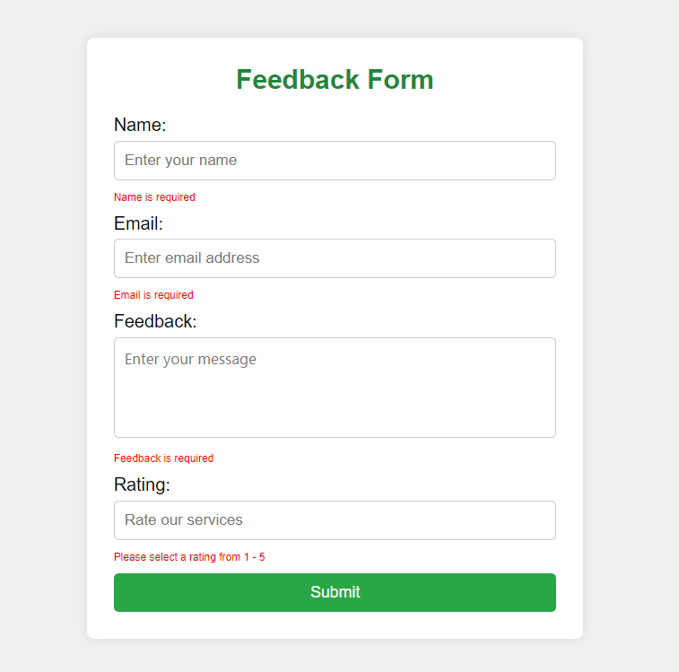
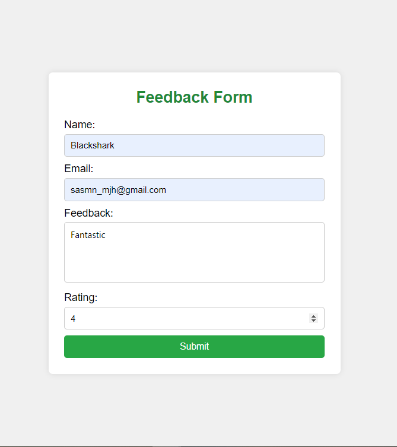

# Challenge Description

**Project Overview**
Objective: Create a web application to capture data from a form, store it in a MySQL database, and retrieve and display the data on a web page using PHP.
Scenario
You are part of a team working for a political campaign. The campaign wants to gather feedback from the public about their candidate. You need to create a web application that captures feedback from a web form, stores it in a database, and displays the feedback on a web page for analysis.
Tasks

_Task 1: Environment Setup_
• Test Area: Ensure you have access to a local development environment with PHP and MySQL capabilities.
• Steps:

1. Verify that you can access a local server (e.g., XAMPP, WAMP).
2. Ensure the Apache and MySQL modules are running on your local server.

_Task 2: Database Creation_
• Test Area: Create a database to store feedback data.
• Steps:

1. Open PHPMyAdmin or a similar database management tool.
2. Create a new database named campaign_feedback.
3. Within this database, create a table named feedback with the following columns:
    id (INT, Primary Key, Auto Increment)
    name (VARCHAR(100))
    email (VARCHAR(100))
    feedback (TEXT)
    rating (INT)
    submission_date (DATETIME, default to current timestamp)

_Task 3: HTML Form Creation_
• Test Area: Develop an HTML form for user input.
• Steps:

1. Create an HTML file named feedback_form.html.
2. Include fields for Name, Email, Feedback, and Rating in the form.
3. Set the form method to POST and the action to a PHP script named submit_feedback.php.
4. Use CSS to style the form to make it visually appealing.
5. Add JavaScript to validate the form inputs before submission.

_Task 4: PHP Script for Data Submission_
• Test Area: Write a PHP script to handle form submission and store the data in the database.
• Steps:

1. Create a PHP file named submit_feedback.php.
2. Write code to capture the form data using the $\_POST array.
3. Establish a connection to the campaign_feedback database.
4. Insert the captured data into the feedback table.
5. Provide a confirmation message to the user upon successful submission.
6. Implement error handling to manage database connection issues or data insertion failures.

_Task 5: PHP Script for Data Retrieval_
• Test Area: Write a PHP script to retrieve and display the stored feedback data.
• Steps:

1. Create a PHP file named view_feedback.php.
2. Establish a connection to the campaign_feedback database.
3. Write a SQL query to select all records from the feedback table.
4. Display the retrieved data in an HTML table on the web page.
5. Use CSS to style the table for better readability.
6. Implement pagination if the dataset is large to improve usability.

_Task 6: Testing and Validation_
• Test Area: Ensure the application works as expected.
• Steps: 7. Test the HTML form by submitting sample feedback data. 8. Verify that the data is correctly inserted into the feedback table. 9. Access the view_feedback.php page to ensure the data is correctly retrieved and displayed. 10. Perform edge case testing to ensure the form handles various inputs and errors gracefully. 11. Test the form and data retrieval on different browsers to ensure cross-browser compatibility.

_Evaluation Criteria_
• Functionality: The form captures data correctly, stores it in the database, and retrieves it for display.
• Code Quality: Clean, well-documented code following best practices.
• Usability: The form and feedback display are user-friendly and intuitive.
• Creativity: Use of CSS and JavaScript to enhance the user interface and experience.
• Error Handling: Proper handling of errors and edge cases in form submission and data retrieval.
• Cross-Browser Compatibility: Ensure the application works smoothly across different web browsers.

